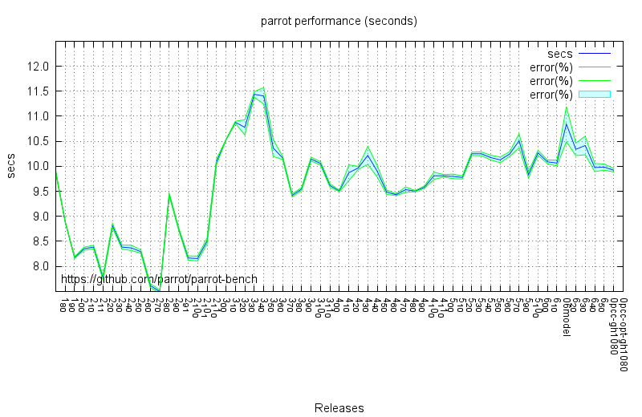

parrot-bench
============

| RELEASE tags          | seconds        | 4x variance  | rel %   |
|-----------------------|---------------:|:------------:|:-------:|
| RELEASE_1_8_0         |  9.883043488	 | (+-0.25%)	|         |
| RELEASE_1_9_0         |  8.889300201	 | (+-0.09%)	| +11.18% |
| RELEASE_2_0_0         |  8.172728006	 | (+-0.22%)	|  +8.77% |
| RELEASE_2_10_0        |  8.165184213	 | (+-0.50%)	|  +0.09% |
| RELEASE_2_10_1        |  8.154784983	 | (+-0.60%)	|  +0.13% |
| RELEASE_2_11_0        |  8.502190304	 | (+-0.70%)	|  -4.09% |
| RELEASE_2_1_0         |  8.352471553	 | (+-0.37%)	|  +1.79% |
| RELEASE_2_1_1         |  8.382326286	 | (+-0.43%)	|  -0.36% |
| RELEASE_2_2_0         |  7.768856426	 | (+-0.55%)	|  +7.90% |
| RELEASE_2_3_0         |  8.814267878	 | (+-0.47%)	| -11.86% |
| RELEASE_2_4_0         |  8.383203835	 | (+-0.47%)	|  +5.14% |
| RELEASE_2_5_0         |  8.368028381	 | (+-0.63%)	|  +0.18% |
| RELEASE_2_6_0         |  8.292280282	 | (+-0.40%)	|  +0.91% |
| RELEASE_2_7_0         |  7.614940353	 | (+-0.53%)	|  +8.89% |
| RELEASE_2_8_0         |  7.492562325	 | (+-0.42%)	|  +1.63% |
| RELEASE_2_9_0         |  9.437535389	 | (+-0.29%)	| -20.61% |
| RELEASE_2_9_1         |  8.744459705	 | (+-0.30%)	|  +7.93% |
| RELEASE_3_0_0         | 10.086863290	 | (+-0.55%)	| -13.31% |
| RELEASE_3_10_0        | 10.144179660	 | (+-0.37%)	|  -0.57% |
| RELEASE_3_11_0        | 10.056918352	 | (+-0.35%)	|  +0.87% |
| RELEASE_3_1_0         | 10.527375496	 | (+-0.06%)	|  -4.47% |
| RELEASE_3_2_0         | 10.879345062	 | (+-0.19%)	|  -3.24% |
| RELEASE_3_3_0         | 10.776853741	 | (+-1.42%)	|  +0.95% |
| RELEASE_3_4_0         | 11.436597522	 | (+-0.49%)	|  -5.77% |
| RELEASE_3_5_0         | 11.405430639	 | (+-1.46%)	|  +0.27% |
| RELEASE_3_6_0         | 10.364548200	 | (+-1.64%)	| +10.04% |
| RELEASE_3_7_0         | 10.164760021	 | (+-0.31%)	|  +1.97% |
| RELEASE_3_8_0         |  9.416783644	 | (+-0.32%)	|  +7.94% |
| RELEASE_3_9_0         |  9.544491018	 | (+-0.31%)	|  -1.34% |
| RELEASE_4_0_0         |  9.614998544	 | (+-0.36%)	|  -0.73% |
| RELEASE_4_10_0        |  9.582978344	 | (+-0.25%)	|  +0.33% |
| RELEASE_4_11_0        |  9.809432968	 | (+-0.75%)	|  -2.31% |
| RELEASE_4_1_0         |  9.506818520	 | (+-0.16%)	|  +3.18% |
| RELEASE_4_2_0         |  9.871481188	 | (+-1.60%)	|  -3.69% |
| RELEASE_4_3_0         |  9.967648008	 | (+-0.29%)	|  -0.96% |
| RELEASE_4_4_0         | 10.216574730	 | (+-1.76%)	|  -2.44% |
| RELEASE_4_5_0         |  9.899043131	 | (+-1.17%)	|  +3.21% |
| RELEASE_4_6_0         |  9.480718387	 | (+-0.44%)	|  +4.41% |
| RELEASE_4_7_0         |  9.430881797	 | (+-0.20%)	|  +0.53% |
| RELEASE_4_8_0         |  9.532461810	 | (+-0.56%)	|  -1.07% |
| RELEASE_4_9_0         |  9.503186442	 | (+-0.13%)	|  +0.31% |
| RELEASE_5_0_0         |  9.809035809	 | (+-0.25%)	|  -3.12% |
| RELEASE_5_10_0        |  9.833842408	 | (+-0.67%)	|  -0.25% |
| RELEASE_5_1_0         |  9.797141010	 | (+-0.46%)	|  +0.37% |
| RELEASE_5_2_0         |  9.776151688	 | (+-0.31%)	|  +0.21% |
| RELEASE_5_3_0         | 10.248564329	 | (+-0.33%)	|  -4.61% |
| RELEASE_5_4_0         | 10.249601501	 | (+-0.37%)	|  -0.01% |
| RELEASE_5_5_0         | 10.173360877	 | (+-0.47%)	|  +0.75% |
| RELEASE_5_6_0         | 10.127534872	 | (+-0.56%)	|  +0.45% |
| RELEASE_5_7_0         | 10.243308239	 | (+-0.46%)	|  -1.13% |
| RELEASE_5_9_0         | 10.509155960	 | (+-1.35%)	|  -2.53% |
| RELEASE_6_0_0         | 10.268596974	 | (+-0.50%)	|  +2.34% |
| RELEASE_6_1_0         | 10.088142136	 | (+-0.38%)	|  +1.79% |
| rurban/6model         | 10.063883400	 | (+-0.57%)	|  +0.24% |
| RELEASE_6_2_0         | 10.842009421	 | (+-3.24%)	|  -6.95% |
| RELEASE_6_3_0         | 10.338726597	 | (+-1.22%)	|  +4.87% |
| RELEASE_6_4_0         | 10.414573971	 | (+-1.78%)	|  -0.73% |
| RELEASE_6_5_0         |  9.974288080	 | (+-0.82%)	|  +4.41% |
| rurban/pcc-gh1080     |  9.983601378	 | (+-0.62%)	|  -0.09% |
| rurban/pcc-opt-gh1080 |  9.922228798	 | (+-0.35%)	|  +0.62% |
| ?RELEASE_6_6_0        |  9.922228798	 | (+-0.35%)	|  +0.52% |

Time in seconds to run all these .pir and .pasm tests without -O.

The tests were selected from `examples/benchmarks`. All tests which
run without error on all successfully built parrots.

Comments:
---------

* RELEASE_1_9_0: **+11.18%**
* RELEASE_2_3_0: _-11.86%_
* RELEASE_2_9_0: _-20.61%_
* RELEASE_3_0_0: _-13.31%_
* RELEASE_3_6_0: **+10.04%**
* RELEASE_4_6_0:  **+4.41%**
* RELEASE_5_3_0:  _-4.61%_
* RELEASE_6_5_0:  **+4.41%** Optimize GC write barriers in the pmc's #1069
